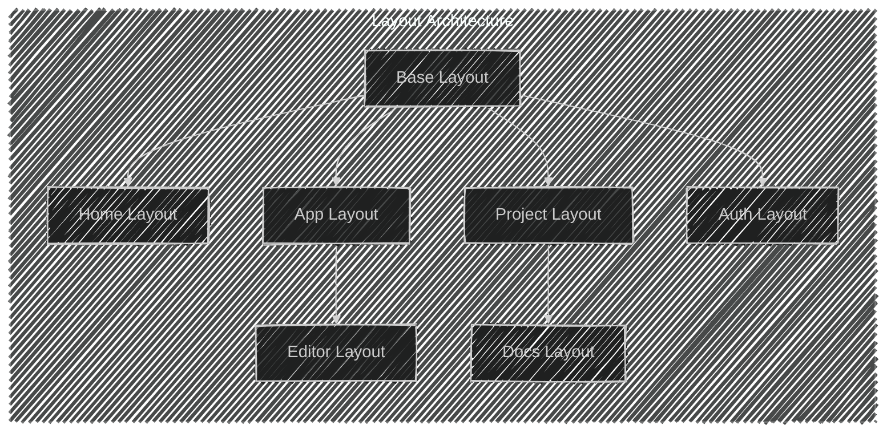

## Layout Architecture

```mermaid

---
config:
  theme: dark
  look: handDrawn
  fontFamily: '''Source Code Pro Variable'', monospace'
  layout: dagre
  themeVariables:
    fontFamily: '''Source Code Pro Variable'', monospace'
---
flowchart BT
 subgraph s1["Layout Architecture"]
        A["Base Layout"]
        
        B["Home Layout"]
        
        C["App Layout"]
        C1["Editor Layout"]

        D["Project Layout"]
        D1["Docs Layout"]

        E["Auth Layout"]
  end
    A --> B & C & D & E
    C --> C1
    D --> D1

```

