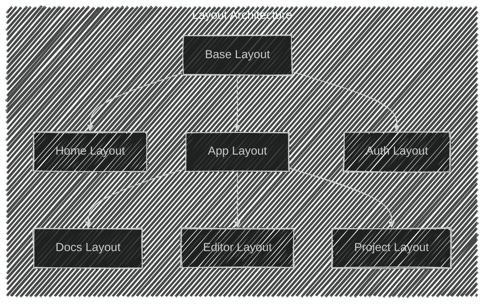

## Layout Architecture

```mermaid

---
config:
  theme: dark
  look: handDrawn
  fontFamily: '''Source Code Pro Variable'', monospace'
  layout: dagre
  themeVariables:
    fontFamily: '''Source Code Pro Variable'', monospace'
---
flowchart BT
 subgraph s1["Layout Architecture"]
        a["Base Layout"]
        
        b["Home Layout"]
        
        c["App Layout"]
        c1["Docs Layout"]
        c2["Editor Layout"]
        c3["Project Layout"]

        d["Auth Layout"]
  end
    a --> b & c & d
    c --> c1 & c2 & c3

```

